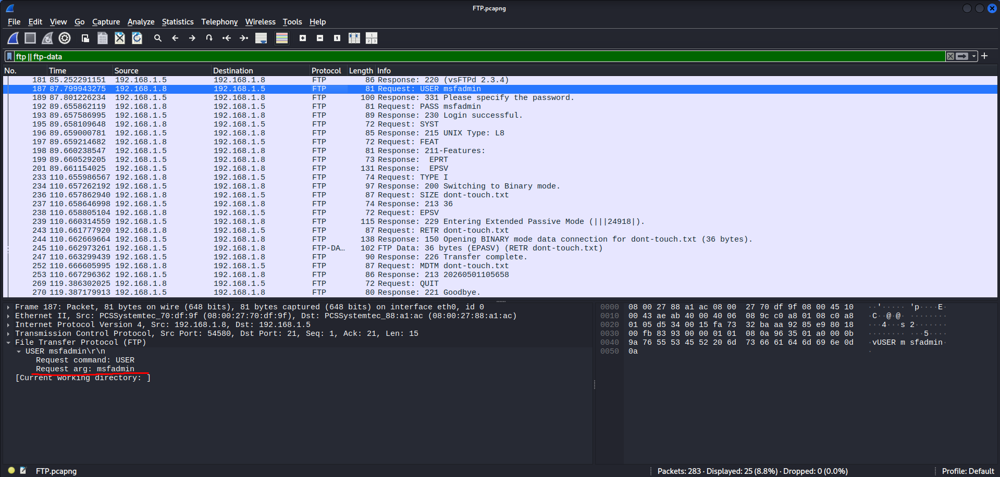
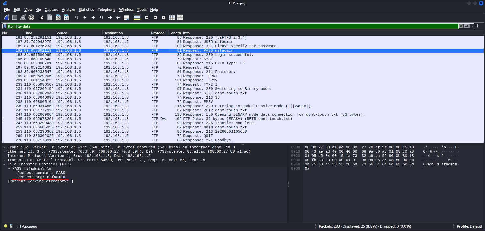
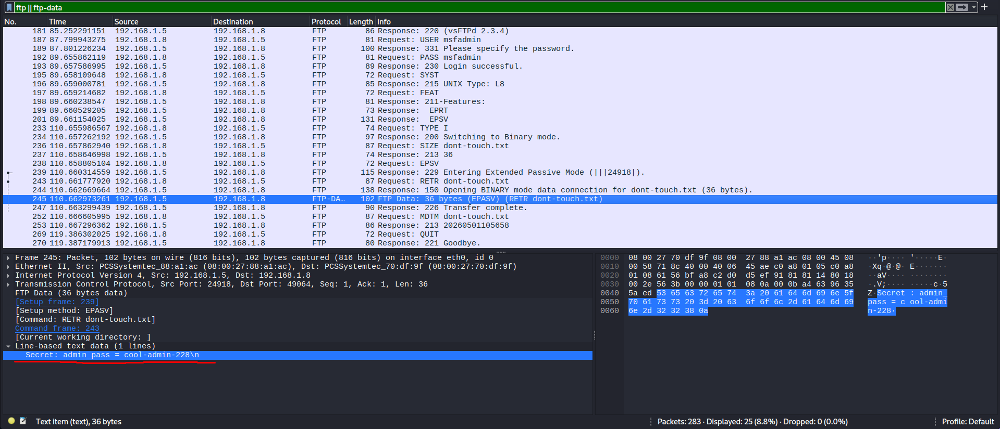

# Анализ безопасности протокола FTP

**Цель:** Показать уязвимость протокола FTP к перехвату данных в открытом виде.

### Инструменты:
* **Kali Linux** (Атакующий/Аналитик) IP: 192.168.1.8
* **Metasploitable** (Целевой сервер) IP: 192.168.1.5
* **Wireshark** (Захват и анализ трафика)

### Ход работы:
1. В Wireshark ввел в фильтр `ftp || ftp-data`.
2. С Kali подключился к Metasploitable через команду `ftp 192.168.1.5`. 
3. Ввёл логин "msfadmin" (код **331** - ожидание пароля).
4. Ввёл пароль "msfadmin" (код **230** - успешная аутентификация).
5. Загрузил файл `dont-touch.txt`. 
6. Завершил сессию командой `quit`.

Для восстановления содержимого файла использовалась функция **"Follow TCP Stream"**.

### Обнаруженные данные:

**Логин пользователя:**  

**Пароль пользователя:**  

**Содержимое перехваченного файла:**  

**Классификация атаки:** Данная активность относится к категории **Sniffing (T1040)** по матрице MITRE ATT&CK.

**Результат:** Перехвачены пароль и содержимое конфиденциального файла.  
**Рекомендации:** Использовать защищённые протоколы **SFTP** или **FTPS**.